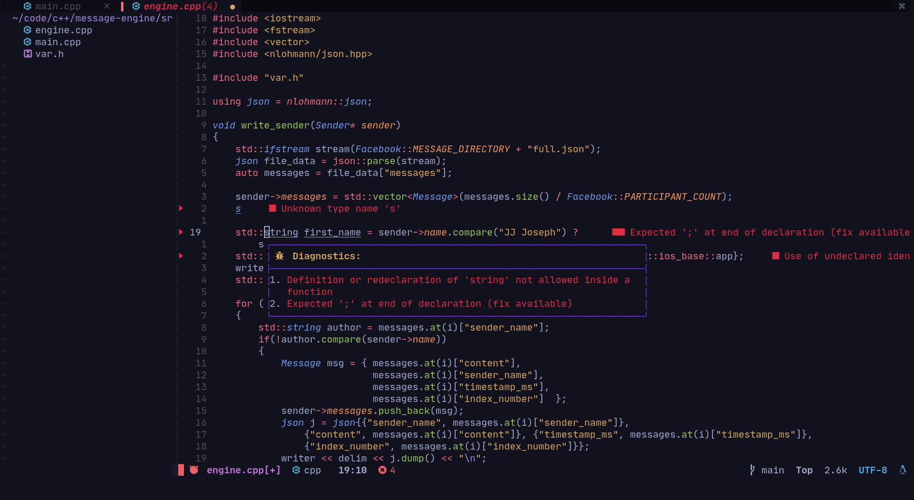

# Customized Neovim w/LSP

* Configured in Lua, for *neovim >=0.5*
* LSP for language server configuration (w/LSPInstall)
* Treesitter for syntax highlighting
* LSPSaga for diagnostics/floaterm
* Compe for completion
* Bufferline/lualine for status line
* Telescope for fuzzy finder
